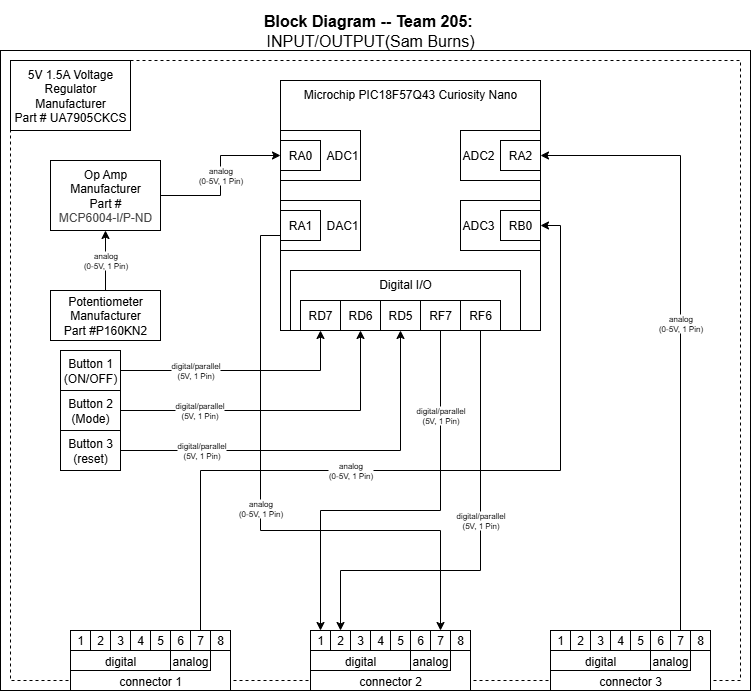

## Overview
My section is the Input/Output board, the bridge between our sensors and lights. Its intended to allow for user control and sensor input to determine what state the light should be. 

Since my unit is the hub of our other units it has 3 team connetions. The "sensors" of my board are the buttons and the popotentiometer. These allow for fine user control compared to the actual sensor boards. The whole board should opperate on 5v & 1.5 Amps. 

Button 1-3 act like the quick controlls on a CD player:

Button 1: On/Off

Button 2: Mode (White-Warm-Cool)

Button 3: reset

The potentiometer controlls the brightness of the light.

## Block Diagram 

