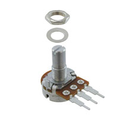
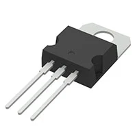

**H bridge**

1. FAN8100N H-Bridge

    {style width:"100" height:"100;"}

    * $1.16/each
    * [link to product](https://www.digikey.com/en/products/detail/fairchild-semiconductor/FAN8100N/11558200)

    | Pros                                      | Cons                                                             |
    | ----------------------------------------- | ---------------------------------------------------------------- |
    | Inexpensive                               | likely way to many pins then needed |
    | Already have the part on hand             | takes up a significant amount of space                                        |
    | Familiar with the part |

1. A3909GLNTR-T

    {style width:"100" height:"100;"}

    * $1.24/each
    * [Link to product](https://www.digikey.com/en/products/detail/allegro-microsystems/A3909GLNTR-T/3979655)

    | Pros                                                              | Cons                |
    | ----------------------------------------------------------------- | ------------------- |
    | Compact foot print                                             | More expensive      |
    | Higher voltage rating                                 | Surface mounting |
    | |                                                 |Unfamiliar interface |

1. ISL55110IVZ

    {style width:"100" height:"100;"}

    * $2.87/each
    * [Link to product](https://www.digikey.com/en/products/detail/renesas-electronics-corporation/ISL55110IVZ/1650617)

    | Pros                                                              | Cons                |
    | ----------------------------------------------------------------- | ------------------- |
    | half bridge                                         |  Higher expense    |
    | Higher voltage rating                                 | surface mount |
                                  |

**Choice:** Option 1: FAN8100N H-Bridge

**Rationale:** It is the option I am most familiar with and I wouldn't have to wait to order it. I already have the part and have designed my schamatic around it.

**Motor** 

2. M1N10FB11G

    {style width:"100" height:"100;"}

    * $3.19/each
    * [link to product](https://www.digikey.com/en/products/detail/nmb-technologies-corporation/M1N10FB11G/2417078)

    | Pros                                      | Cons                                                             |
    | ----------------------------------------- | ---------------------------------------------------------------- |
    | Familar with motor type                               | very long shipping time |
    | Have some on hand            | Heavy compared to the others                                 |
    

2. FIT0467

    {style width:"100" height:"100;"}

    * $11.9/each
    * [Link to product](https://www.digikey.com/en/products/detail/dfrobot/FIT0467/7087156)

    | Pros                                                              | Cons                |
    | ----------------------------------------------------------------- | ------------------- |
    | familar with motor type                                            | high cost     |
    | higher build quality                                  |Likely too high quality for the projec|

2. PPN7PA12C1

    {style width:"100" height:"100;"}

    * $3.71/each
    * [Link to product](https://www.digikey.com/en/products/detail/nmb-technologies-corporation/PPN7PA12C1/2417079)

    | Pros                                                              | Cons                |
    | ----------------------------------------------------------------- | ------------------- |
    |   Low profile                                        |  Most expensive part    |
    |   Light weight                        | Weakest torque compared to selection |
   

**Choice:** Option 1: M1N10FB11G

**Rationale:** It was the first pick due to time constraints and having to fix this project. 

**Voltage Regulator**

3. UA7905CKCS

    {style width:"100" height:"100;"}

    * $1.02/each
    * [link to product](https://www.digikey.com/en/products/detail/texas-instruments/UA7905CKCS/660187)

    | Pros                                      | Cons                                                             |
    | ----------------------------------------- | ---------------------------------------------------------------- |
    | Through Hole                              | Tall component |
    | Good max voltage rating           | 6 weeks shiping time                                  |
    | Aleady have on hand           |

3. L7805CV

    {style width:"100" height:"100;"}

    * $0.5/each
    * [Link to product](https://www.digikey.com/en/products/detail/stmicroelectronics/L7805CV/585964)

    | Pros                                                              | Cons                |
    | ----------------------------------------------------------------- | ------------------- |
    | Inexpensive                                            | Tall componet    |
    | Protectoin features (if over temps, short circuit)       |8 weeks shiping time|     
                  

3. NCV7805BDTRKG

    {style width:"100" height:"100;"}

    * $0.57/each
    * [Link to product](https://www.digikey.com/en/products/detail/onsemi/NCV7805BDTRKG/1792758)

    | Pros                                                              | Cons                |
    | ----------------------------------------------------------------- | ------------------- |
    | Automotive grade                                      |  Surface mount    |
    | Low profile                              | Way to high quality for this projcet |
    
**Choice:** Option 1: UA7905CKCS

**Rationale:** It is the option I am most familiar with and I wouldn't have to wait for it to arrive. I have a lot of reasorces on how to build my own power supply with this exact part so it benefits me the most. While something more compact would be nice I think for ease of life and design this part will be just fine.