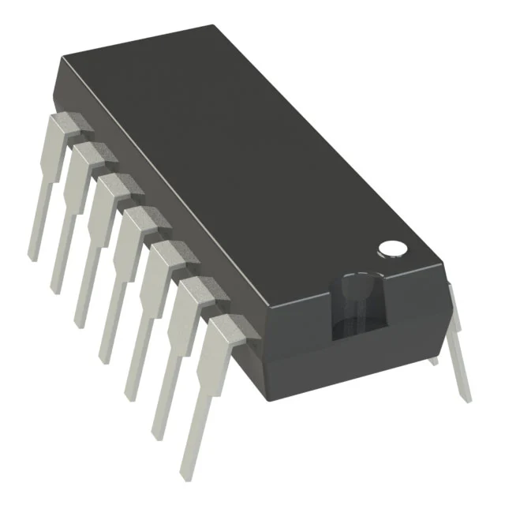
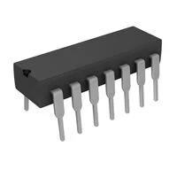
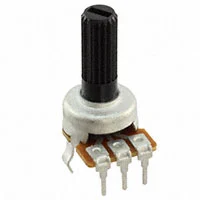
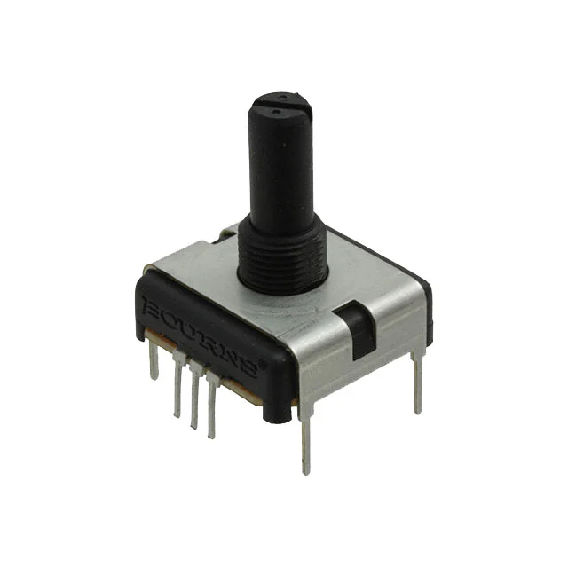

**Op Amps**

1. MCP6004-I/P-ND IC OPAMP GP 4 CIRCUIT 14DIP

    {style width:"100" height:"100;"}

    * $0.59/each
    * [link to product](https://www.digikey.com/en/products/detail/microchip-technology/MCP6004-I-P/523060?gclsrc=aw.ds&gad_source=1&gad_campaignid=120565755&gbraid=0AAAAADrbLlgvmi-7nu49IK00wDfqUZ9nG&gclid=CjwKCAjwr8LHBhBKEiwAy47uUg2Khy4UAju_plOeBhHjGhTL9rCemC6lQ3zkZeHUy87t1d8vDi-Z9BoCKtUQAvD_BwE)

    | Pros                                      | Cons                                                             |
    | ----------------------------------------- | ---------------------------------------------------------------- |
    | Inexpensive                               | likely way to many pins then needed |
    | Already have the part on hand             | takes up a significant amount of space                                        |
    | Familiar with the part |

1. LT6004IMS8#TRPBF IC OPAMP GP 2 CIRCUIT 8MSOP

    {style width:"100" height:"100;"}

    * $4.94/each
    * [Link to product](http://www.digikey.com/product-detail/en/636L3I001M84320/CTX936TR-ND/2292940)

    | Pros                                                              | Cons                |
    | ----------------------------------------------------------------- | ------------------- |
    | Compact foot print                                             | More expensive      |
    | Higher voltage rating                                 | Surface mounting |
    | |                                                 |Unfamiliar interface |

1. LM324N IC OPAMP GP 4 CIRCUIT 14DIP

    {style width:"100" height:"100;"}

    * $0.47/each
    * [Link to product](http://www.digikey.com/product-detail/en/636L3I001M84320/CTX936TR-ND/2292940)

    | Pros                                                              | Cons                |
    | ----------------------------------------------------------------- | ------------------- |
    | Least expensive                                          |  Notably higher minimum opperation voltage    |
    | Higher voltage rating                                 | Higher Output Current channel |
    | Smaller voltage offset                                 | 

**Choice:** Option 1: MCP6004-I/P-ND IC OPAMP GP 4 CIRCUIT 14DIP

**Rationale:** It is the option I am most familiar with and I wouldn't have to wait to order it. It is more then capable for the task I need it for.

**Potentiometer**

2. P120PK-Y25BR10K

    {style width:"100" height:"100;"}

    * $1.42/each
    * [link to product](https://www.digikey.com/en/products/detail/tt-electronics-bi/P120PK-Y25BR10K/5957454)

    | Pros                                      | Cons                                                             |
    | ----------------------------------------- | ---------------------------------------------------------------- |
    | Through Hole, snap in mounting                               | very long shipping time |
    | Similar to the part used in class             | Low resistance (10k Ohms)                                     |
    

2. P160KN2-0EC15B100K

    {style width:"100" height:"100;"}

    * $1.66/each
    * [Link to product](https://www.digikey.com/en/products/detail/tt-electronics-bi/P160KN2-0EC15B100K/3587330)

    | Pros                                                              | Cons                |
    | ----------------------------------------------------------------- | ------------------- |
    | Already have it on hand                                            | Pins are horizontal     |
    | 100,000 cycle life                                 | Surface mounting |
                                                     |Very long shipping time|

2. PCW1J-B24-BAB103L 

    {style width:"100" height:"100;"}

    * $5.92/each
    * [Link to product](http://www.digikey.com/product-detail/en/636L3I001M84320/CTX936TR-ND/2292940)

    | Pros                                                              | Cons                |
    | ----------------------------------------------------------------- | ------------------- |
    | Panel Mount                                         |  Most expensive part    |
    | Low profile                              | Likely too high quality for the project |
    | Clean design                                | 

**Choice:** Option 2: P160KN2-0EC15B100K

**Rationale:** It is the option I am most familiar with and I wouldn't have to wait for it to arrive. The pin difficulty can be manage through varius design choices and easily 3D printed parts. 

**Voltage Regulator**

3. UA7905CKCS

    {style width:"100" height:"100;"}

    * $1.02/each
    * [link to product](https://www.digikey.com/en/products/detail/texas-instruments/UA7905CKCS/660187)

    | Pros                                      | Cons                                                             |
    | ----------------------------------------- | ---------------------------------------------------------------- |
    | Through Hole                              | Tall component |
    | Good max voltage rating           | 6 weeks shiping time                                  |
    | Aleady have on hand           |

3. L7805CV

    {style width:"100" height:"100;"}

    * $0.5/each
    * [Link to product](https://www.digikey.com/en/products/detail/stmicroelectronics/L7805CV/585964)

    | Pros                                                              | Cons                |
    | ----------------------------------------------------------------- | ------------------- |
    | Cheap                                            | Tall componet    |
    | Protectoin features (if over temps, short circuit)       |8 weeks shiping time|     
                  

3. NCV7805BDTRKG

    {style width:"100" height:"100;"}

    * $0.57/each
    * [Link to product](https://www.digikey.com/en/products/detail/onsemi/NCV7805BDTRKG/1792758)

    | Pros                                                              | Cons                |
    | ----------------------------------------------------------------- | ------------------- |
    | Automotive grade                                      |  Surface mount    |
    | Low profile                              | Likely too high quality for the project |
    
**Choice:** Option 1: UA7905CKCS

**Rationale:** It is the option I am most familiar with and I wouldn't have to wait for it to arrive. I have a lot of reasorces on how to build my own power supply with this exact part so it benefits me the most. While something more compact would be nice I think for ease of life and design this part will be just fine.