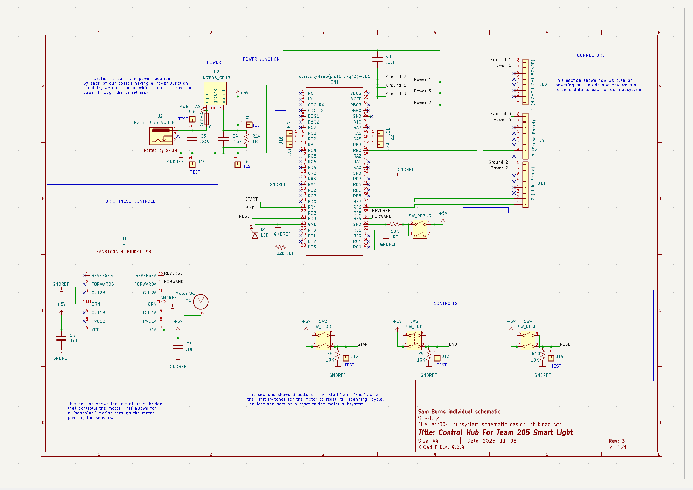

## Overview

This schematic is designed to serve as the central hub for my team’s project. It gathers data from the sensor circuits, along with input controls, and sends the corresponding signals to the lighting circuit. The board uses a motor to allow for a wider range for the sensor. This was implemented to satisfy the design criteria of this course but I believe this would allow for improved detection rate. The updated change its that this board will also supply power to the other boards. While my teams boards will be able to be powered on their own when combined this board should supply enough power for all the boards. 

{style width:"350" height:"300;"}
**Figure 1:** Showing schematic.

## Resouces

The schematic as a PDF download is available [*here*](design-sb.pdf), and the Zip folder of the project [*here*](egr304-subsystem schematic design-sb.zip).