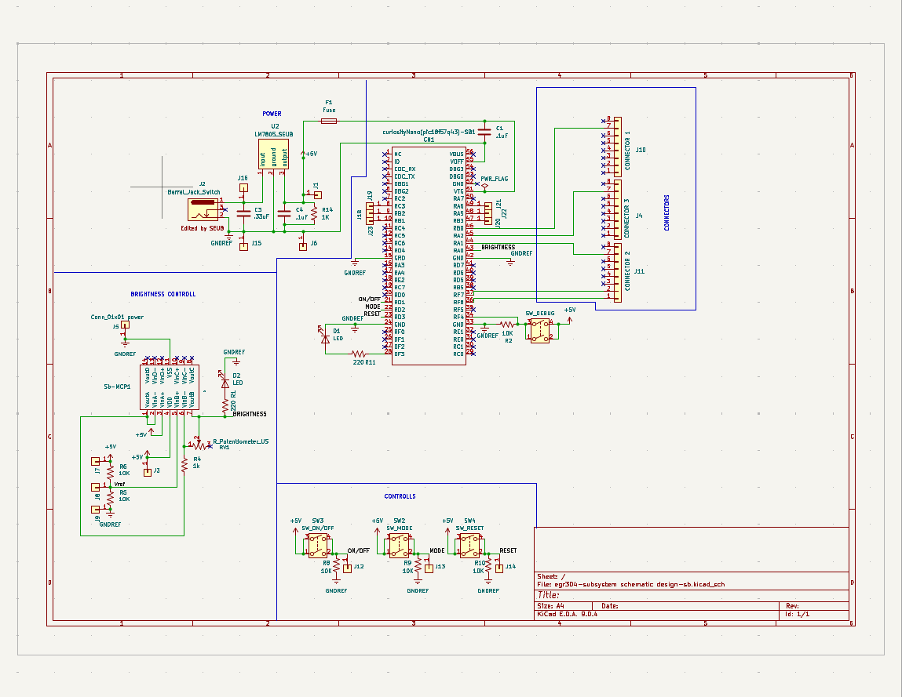

## Overview

This schematic is designed top act as a hub for my team project. It collects the data from our sensor circuits, along with its input controlls, to send signals to the lighting circuit. It has 3 buttons for hands on control along with a potentiomitor to act as a brightness control for the light. 

It is undecided if this board will have the master code to take the raw signal from the sensor boards or it would just read values from them. As seen on the board there are many points to test and measure the hardware incase of failure. In the extream sitiation where all control fails the senser board alone should provide enough "control" to make the light work as intended. 

{style width:"350" height:"300;"}
**Figure 1:** Showing schematic.

## Resouces

The schematic as a PDF download is available [*here*](Schematic-SB.pdf), and the Zip folder of the project [*here*](egr304-subsystem schematic design-sb.zip).