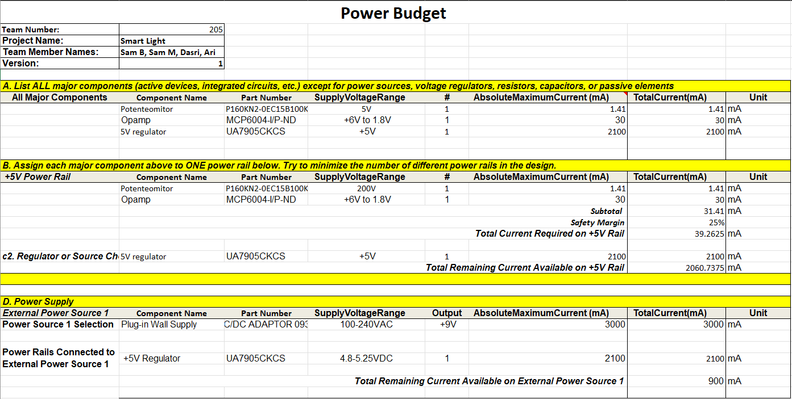

## Overview
This is a very rough draft of my power budget. I am sure it will get more ironed out as our project gets more finalized. I stuck to a wall mounted powersupply because that is what we have on hand. Idealy we would collect a battery pack but for this round I wanted to keep things simple. As you can see my circuit is very simple and has minimal parts that require limited amount of power.

{style width:"350" height:"300;"}

## Conclusions

This is just a rough draft, I intend to finalize this as we get closer to closing out this project.

## Resouces

The power budget as a PDF download is available [*here*](PowerBudgetSB.pdf), and a Microsoft Excel Sheet [*here*](PowerBudgetSB.xlsx).