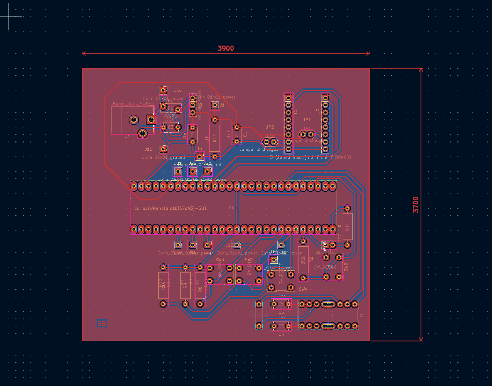

## Overview

This PCB desgin shows what the board will look like once its fabricated. Please note that the mesurments are in Mils. We never got our boards inperson, that is why, per instructor instructions me and my team will show the JLC pcb renders of our boards.

{style width:"350" height:"300;"}
**Figure 1:** Showing Screen shot of PCB

{style width:"350" height:"300;"}
**Figure 2:** Showing Screen shot of PCB

{style width:"350" height:"300;"}
**Figure 3:** Showing Screen shot of PCB

## Resouces

The schematic as a PDF download is available [*here*](PCB Printout 1-1.pdf), and the Gerber Zip folder of the project [*here*](Sam Burns 205 Gerber (2).zip).